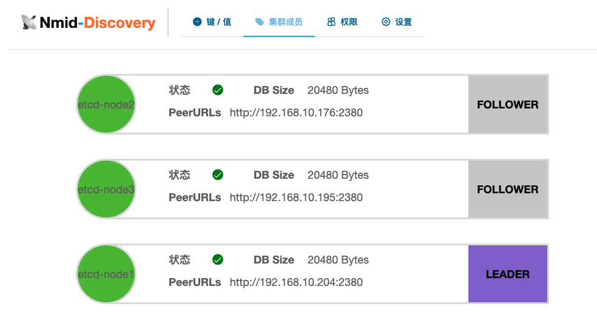
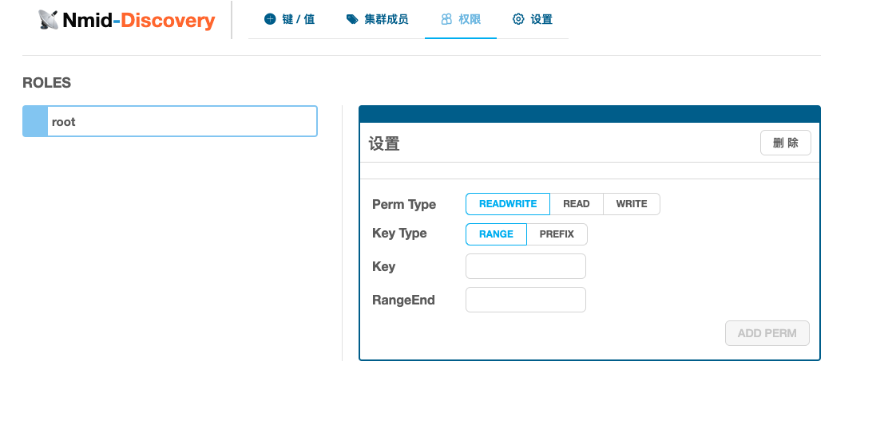
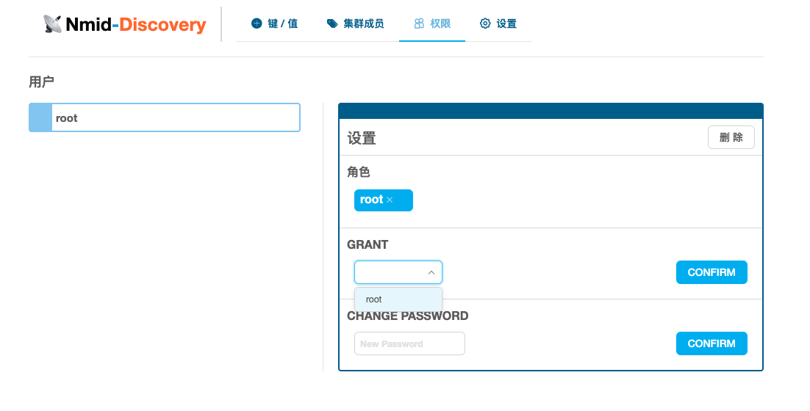

etcdUI base on [e3w](https://github.com/soyking/e3w)
===

## Quick Start

```
docker-compose up
# open http://localhost:8080
```

## Overview

KEY/VALUE


MEMBERS



ROLES



USERS



SETTING


## Usage

1.Fetch the project `go get github.com/HughNian/etcdui`

2.frontend

```
cd static
npm install
npm run publish
```

3.backend

a. Start etcd, such as [goreman](https://github.com/coreos/etcd/#running-a-local-etcd-cluster)

b. Edit conf/config.default.ini if needed, `go build && ./etcdui`